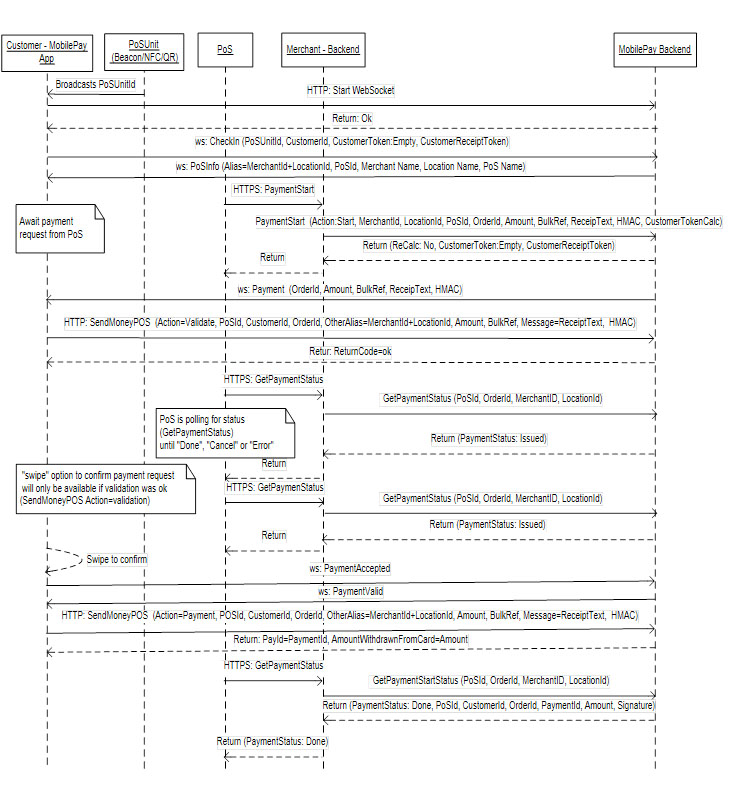
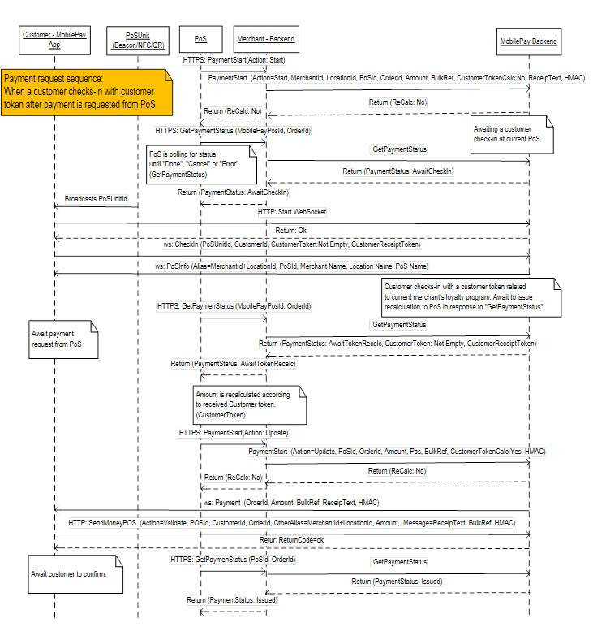
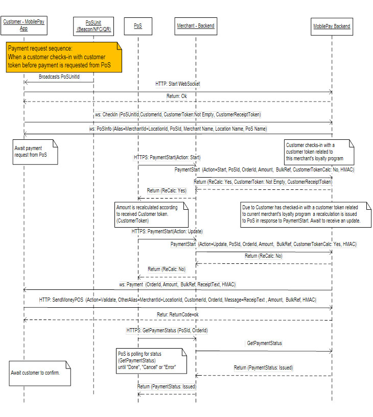
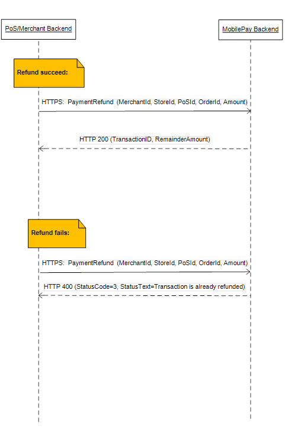

# PoS Payment Methods: PoS -> MobilePay Backend

<!-- TOC depthFrom:1 depthTo:6 withLinks:1 updateOnSave:1 orderedList:0 -->
- [PaymentStart](#PaymentStart)
- [GetPaymentStatus](#GetPaymentStatus)
- [PaymentCancel](#PaymentCancel)
- [PaymentRefund](#PaymentRefund)
- [PoS Payment Polling Sequence](#PoS-Payment-Polling-Sequence)
  - [PoS Payment E2E-sequence](#PoS-Payment-E2E-sequence)
  - [Payment request before customer token check-in sequence](#Payment-request-before-customer-token-check-in-sequence)
  - [Payment request after customer token check-in sequence](#Payment-request-after-customer-token-check-in-sequence)
  - [PaymentRefund E2E sequence](#PaymentRefund-E2E-sequence)
<!-- /TOC -->


## PaymentStart
### Purpose:
This method is called when the Point of Sale (cash register / terminal) wishes to start a payment (The customer does not have to be checked-in in advance). 
PaymentStart is only possible if no active MobilePay payment entity exists for current PoS – unless it is an update (Action=Update) for a payment entity in state "AwaitTokenRecalc".
A PaymentStart will delete earlier finished payment entities – i.e., payment entities in status 'Done', 'Cancel' or 'Error'.

### Request:
```json
{
"MerchantId":"POSDK99999",
"LocationId":"88888",
"PoSId":"a123456-b123-c123-d123-e12345678901",
"OrderId":"123A124321",
"Amount":"1023.43",
"BulkRef":"MP Bulk Reference",
"Action":"Start",
"CustomerTokenCalc":0,
"HMAC":"NTsitSPXe9f5o8Nclza8ZQIx9mdom6GdcyoCQvGs9o0="
}
```

<table>
  <tr>
    <th>Parameter</th>
    <th>Type</th>
    <th>Required</th>
    <th>Description</th>	
  </tr>
  <tr>
    <td>MerchantId</td>
    <td>String</td>
    <td>required</td>
    <td>Merchant ID related to current PoS ID.</td>
  </tr>
  <tr>
    <td>LocationId</td>
    <td>String</td>
    <td>required</td>
    <td>Location ID related to current merchant ID and PoS ID.</td>
  </tr>
  <tr>
    <td>PoSId</td>
    <td>String</td>
    <td>required</td>
    <td>Current Point of Sale ID (cash register/terminal).</td>
  </tr>
  <tr>
    <td>OrderId</td>
    <td>String</td>
    <td>required</td>
    <td>The OrderId is a unique id that identifies the payment. The OrderId is issued by the merchant and is attached to the payment inside MobilePay system. <br>The order ID must be unique for the merchant/location combination. This means that there should be only one completed payment with any given order ID for the same merchant and location (store) during the lifetime of the merchant/location. <br>CASE SENTITIVE </td>
  </tr>
  <tr>
    <td>Amount</td>
    <td>String</td>
    <td>required</td>
    <td>The amount for the payment. Always with 2 decimals and no thousand separators. <br>Note: Decimal point is "." </td>
  </tr>
  <tr>
    <td>BulkRef</td>
    <td>String</td>
    <td>required</td>
    <td> An option for grouping the payments – a text or ID. The field has a maximum length of 18 characters. <br>If the field remains empty and the merchant does not have a Bulkpost agreement, the merchant will receive all mobile payments from any connected shops as individual postings in the reconciliation file. <br>If the field remains empty and the merchant does have a Bulkpost agreement, the merchant will receive all mobile payments bulked with a default bulkref of the MP Enterprise Serialnumber value in the reconciliation file. <br>It must be a merchant decision whether they want all individual postings or a bulk posting per store or the entire group as one posting.<br>The field is mandatory in the request even though it might be an empty string.</td>
  </tr>
  <tr>
    <td>Action</td>
    <td>String</td>
    <td>required</td>
    <td>Action values:<br>"Start": Initiate a payment.<br>"Update": Update a current payment after recalculation.</td>
  </tr>
  <tr>
    <td>CustomerTokenCalc</td>
    <td>String</td>
    <td>required</td>
    <td>The field indicate if the loyalty payment flow must be initiated if applicable or not. <br>“0”: Loyalty flow will be initiated if customer is a member of the merchant’s loyalty program. <br>“1”: Ignore loyalty flow</td>
  </tr>
  <tr>
    <td>HMAC</td>
    <td>String</td>
    <td>required</td>
    <td>The HMAC is calculated based on the other parameters. The key for the HMAC is a MerchantKey issued by MobilePay. <br><br>Base64 (with padding) encoded HMAC SHA256:<br>HMAC = Base64(hmacSha256(<br>ISO88591Bytes(“{MerchantId+LocationId}#{PoSId}#{OrderId}#{Amount}#{BulkRef}#”), ISO88591Bytes(MerchantKey))) <br>Note that fields must be trimmed, see example [here](https://developer.mobilepay.dk/node/2546)</td>
  </tr>
</table>

### Response
HTTP 200 – Ok
```json
{
"ReCalc":0,
"CustomerToken":null,
"CustomerReceiptToken":null
}
```

<table>
  <tr>
    <th>Parameter</th>
    <th>Type</th>
    <th>Description</th>	
  </tr>
  <tr>
    <td>ReCalc</td>
    <td>Integer</td>
    <td>0 – normal usage.<br>1 – recalculation must be executed and payment updated.</td>
  </tr>
<tr>
    <td>CustomerToken</td>
    <td>String</td>
    <td>null if no recalculation is needed yet.</td>
  </tr>
  <tr>
    <td>CustomerReceiptToken</td>
    <td>String</td>
    <td>Used for customer receipt token (In DK: Service agreement with Storebox implies that Storebox user Id is provided). May be null. Max 32 characters.</td>
  </tr>
</table>

HTTP 400 – See PaymentStart error codes
```json
{
"StatusCode":10,
"StatusText":"Missing or invalid parameters"
}
```
### PaymentStart Error Codes
<table>
  <tr>
    <th>Error code</th>
    <th>Error text</th>
  </tr>
  <tr>
    <td>10</td>
    <td>Missing or invalid parameters.</td>
  </tr>
  <tr>
    <td>30</td>
    <td>The key “MerchantId, LocationId and PoSId” does not exist</td>
  </tr>
  <tr>
    <td>40</td>
    <td>Payment already exists and has been paid </td>
  </tr>
  <tr>
    <td>50</td>
    <td>Payment already in progress </td>
  </tr>
</table>

## GetPaymentStatus
### Purpose:
Get a payment status for current PoS ID.
Used for polling a payment status. Polling has to be done every 1 second until the PaymentStatus is 100 ('Done') or if it rejects the payment request (PaymentStatus 40 ('Cancel') or 50 ('Error')).

### Request:
```json
{
"MerchantId":"POSDK99999",
"LocationId":"88888",
"PoSId":"a123456-b123-c123-d123-e12345678901",
"OrderId":"123A124321"
}
```
<table>
  <tr>
    <th>Parameter</th>
    <th>Type</th>
    <th>Required</th>
    <th>Description</th>	
  </tr>
  <tr>
    <td>MerchantId</td>
    <td>String</td>
    <td>required</td>
    <td>Merchant ID related to current PoS ID.</td>
  </tr>
  <tr>
    <td>LocationId</td>
    <td>String</td>
    <td>required</td>
    <td>Location ID related to current merchant ID and PoS ID.</td>
  </tr>
  <tr>
    <td>PoSId</td>
    <td>String</td>
    <td>required</td>
    <td>Current Point of Sale ID (cash register/terminal).</td>
  </tr>
  <tr>
    <td>OrderId</td>
    <td>String</td>
    <td>required</td>
    <td>Order ID related to current payment status request.</td>
  </tr>
</table>

### Response
HTTP 200 – Ok
```json
{
"PoSId":"a123456-b123-c123-d123-e12345678901",
"PaymentStatus":20,
"OrderId":"123A124321",
"TransactionId":"BA12366351512",
"Amount":1023.43,
"CustomerId":"abc123",
"CustomerToken":"",
"CustomerReceiptToken":"",
"PaymentSignature":"null"
}
```
<table>
  <tr>
    <th>Parameter</th>
    <th>Type</th>
    <th>Description</th>	
  </tr>
  <tr>
    <td>PoSId</td>
    <td>String</td>
    <td>Unique ID that identifies the PoS that has initiated current payment request.</td>
  </tr>
  <tr>
    <td>PaymentStatus</td>
    <td>Integer</td>
    <td>See status values below <br>-<b>10 ('Idle')</b> No payment request in the queue<br>- <b>20 ('Issued')</b> - Payment request is sent to customer.<br>- <b>30 ('AwaitCheckIn')</b> - Await customer check-in.<br>- <b>40 ('Cancel')</b> - Customer has cancelled/rejected payment request.<br>- <b>50 ('Error')</b> - MobilePay is not able to handle the payment – the PoS should cancel the MobilePay payment request.<br>- <b>60 (‘AwaitTokenRecalc’)</b> – Await for PoS system to update payment after recalculation.<br>- <b>80 ('PaymentAccepted')</b> - The payment request is accepted by the customer – await payment confirmation from the payment transaction system.<br>- <b>100 ('Done')</b> - "Payment Confirmed" and TransactionId, PaymentSignature, Amount, CustomerId (optional) will contain a value.</td>
  </tr>
  <tr>
    <td>OrderId</td>
    <td>String</td>
    <td>The OrderId assigned to current payment.</td>
  </tr>
  <tr>
    <td>TransactionId</td>
    <td>String</td>
    <td>Unique ID that identifies the payment (transaction ID). ID is generated by Danske Bank and is shown on the receipt inside the MobilePay app. </td>
  </tr>
  <tr>
    <td>Amount</td>
    <td>Number</td>
    <td>The amount for the payment. <br>Note: Decimal point is “.”</td>
  </tr>
  <tr>
    <td>CustomerId</td>
    <td>String</td>
    <td>Unique ID of the customer. The ID is generated by MobilePay. </td>
  </tr>
  <tr>
    <td>CustomerToken</td>
    <td>String</td>
    <td>Contains customer token if customer has checked-In with a merchant token ID related to this merchant’s loyalty program. </td>
  </tr>
  <tr>
    <td>CustomerReceiptToken</td>
    <td>String</td>
    <td>Used for customer receipt token (In DK: Service agreement with Storebox implies that Storebox user Id is provided) <br>Max 32 char.</td>
  </tr>
  <tr>
    <td>PaymentSignature</td>
    <td>null</td>
    <td>null (deprecated).</td>
  </tr>
</table>

HTTP 400 – See GetPaymentStatus error codes
```json
{
"StatusCode":10,
"StatusText":"Missing or invalid parameters"
}
```
### GetPaymentStatus Error Codes
<table>
  <tr>
    <th>Error code</th>
    <th>Error text</th>
  </tr>
  <tr>
    <td>10</td>
    <td>Missing or invalid parameters.</td>
  </tr>
  <tr>
    <td>30</td>
    <td>The key “MerchantId, LocationId and PoSId” does not exist</td>
  </tr>
</table>

## PaymentCancel
### Purpose:
Cancel payment request for current PoS ID.
Cancel is principal possible as long as earlier request for payment hasn't been finalized (status 100).
A PaymentCancel will delete current payment entity active or not unless earlier finished payment ended in status Done (status code 100) which will remains until a new payment starts.

### Request:
```json
{
"MerchantId":"POSDK99999",
"LocationId":"88888",
"PoSId":"a123456-b123-c123-d123-e12345678901"
}
```
<table>
  <tr>
    <th>Parameter</th>
    <th>Type</th>
    <th>Required</th>
    <th>Description</th>	
  </tr>
  <tr>
    <td>MerchantId</td>
    <td>String</td>
    <td>required</td>
    <td>Merchant ID related to current PoS ID.</td>
  </tr>
  <tr>
    <td>LocationId</td>
    <td>String</td>
    <td>required</td>
    <td>Location ID related to current merchant ID and PoS ID.</td>
  </tr>
  <tr>
    <td>PoSId</td>
    <td>String</td>
    <td>required</td>
    <td>Current Point of Sale ID (cash register/terminal).</td>
  </tr>
</table>

### Response
HTTP 200 – Ok
```json
{
}
```

HTTP 400 – See PaymentCancel error codes
```json
{
"StatusCode":10,
"StatusText":"Missing or invalid parameters"
}
```
### PaymentCancel Error Codes
<table>
  <tr>
    <th>Error code</th>
    <th>Error text</th>
  </tr>
  <tr>
    <td>10</td>
    <td>Missing or invalid parameters.</td>
  </tr>
  <tr>
    <td>30</td>
    <td>The key “MerchantId, LocationId and PoSId” does not exist</td>
  </tr>
  <tr>
    <td>50</td>
    <td>Action not possible. </td>
  </tr>
</table>

## PaymentRefund
### Purpose:
Refund part of or the entire amount of the payment.
A payment refund can be made days/weeks after the original payment has been made.
"PaymentRefund" is a stand-alone method and must be called directly. The response code from this call will indicate success or failure. 
The "OrderId" value must be entered from either PoS or merchant backend.

### Request:
```json
{
"MerchantId":"POSDK99999",
"LocationId":"88888",
"PoSId":"a123456-b123-c123-d123-e12345678901",
 "OrderId":"123A124321",
"Amount":"100.00",
"BulkRef":""
}
```
<table>
  <tr>
    <th>Parameter</th>
    <th>Type</th>
    <th>Required</th>
    <th>Description</th>	
  </tr>
  <tr>
    <td>MerchantId</td>
    <td>String</td>
    <td>required</td>
    <td>Id of the merchant.</td>
  </tr>
  <tr>
    <td>LocationId</td>
    <td>String</td>
    <td>required</td>
    <td>Location ID related to current merchant ID and PoS ID.</td>
  </tr>
  <tr>
    <td>PoSId</td>
    <td>String</td>
    <td>required</td>
    <td>Current Point of Sale ID (cash register/terminal).</td>
  </tr>
  <tr>
    <td>OrderId</td>
    <td>String</td>
    <td>required</td>
    <td>Order ID that identifies the payment to refund. </td>
  </tr>
  <tr>
    <td>Amount</td>
    <td>String</td>
    <td>required</td>
    <td>Amount to refund. <br>If  0.00 or blank, the whole transaction will be refunded.<br>Note: Decimal point is “.”<br>Examples: "Amount": "0.00"  -  "Amount": "100.00"</td>
  </tr>
  <tr>
    <td>BulkRef</td>
    <td>String</td>
    <td>required</td>
    <td>Note: this parameter is required but currently only a placeholder for future use. For now, passed values will not be used, but we recommend preparing your solution for this feature. We expect to implement this in an upcoming update of the API.<br> An option for grouping the refunds – a text or ID. The field has a maximum length of 18 characters.<br> If the field remains empty and the merchant does not have a Bulkpost agreement, the merchant will receive all mobile refunds from any connected shops as individual postings in the reconciliation file.<br> If the field remains empty and the merchant does have a Bulkpost agreement, the merchant will receive all mobile refunds bulked with a default BulkRef of the MP Enterprise Serialnumber value in the reconciliation file.<br> It must be a merchant decision whether they want all individual postings or an bulk posting per store or the entire group as one posting.</td>
  </tr>
</table>

### Response
HTTP 200 – Ok
```json
{
"Remainder":10.75,
"TransactionId":"1122334455A"
}
```

HTTP 400 – See PaymentRefund error codes
```json
{
"StatusCode":10,
"StatusText":"Missing or invalid parameters"
}
```
### PaymentRefund Error Codes
<table>
  <tr>
    <th>Error code</th>
    <th>Error text</th>
  </tr>
  <tr>
    <td>1</td>
    <td>Order cannot be found (this order has not been paid by the customer, or it has been more than 3 months since the order has been paid)</td>
  </tr>
  <tr>
  <tr>
    <td>2</td>
    <td>Amount is larger than remaining refundable amount on transaction </td>
  </tr>
  <tr>
  <tr>
    <td>3</td>
    <td>Transaction is already refunded</td>
  </tr>
  <tr>
  <tr>
    <td>10</td>
    <td>Missing or invalid parameters.</td>
  </tr>
  <tr>
    <td>30</td>
    <td>The key “MerchantId, LocationId and PoSId” does not exist</td>
  </tr>
  <tr>
    <td>50</td>
    <td>Action not possible. </td>
  </tr>
  <tr>
    <td>99</td>
    <td>Technical error (refund cannot be performed) </td>
  </tr>
  <tr>
</table>

## PoS Payment Polling Sequence
### PoS Payment E2E-sequence
[](assets/images/1_PoS_Payment_E2E-sequence.jpg)

### Payment request before customer token check-in sequence
[](assets/images/2_Payment_request_before_customer_token_check-in_sequence.jpg)

### Payment request after customer token check-in sequence
[](assets/images/3_Payment_request_after_customer_token_check-in_sequence.jpg)

### PaymentRefund E2E sequence
[](assets/images/4_PaymentRefund_E2E_sequence..jpg)
